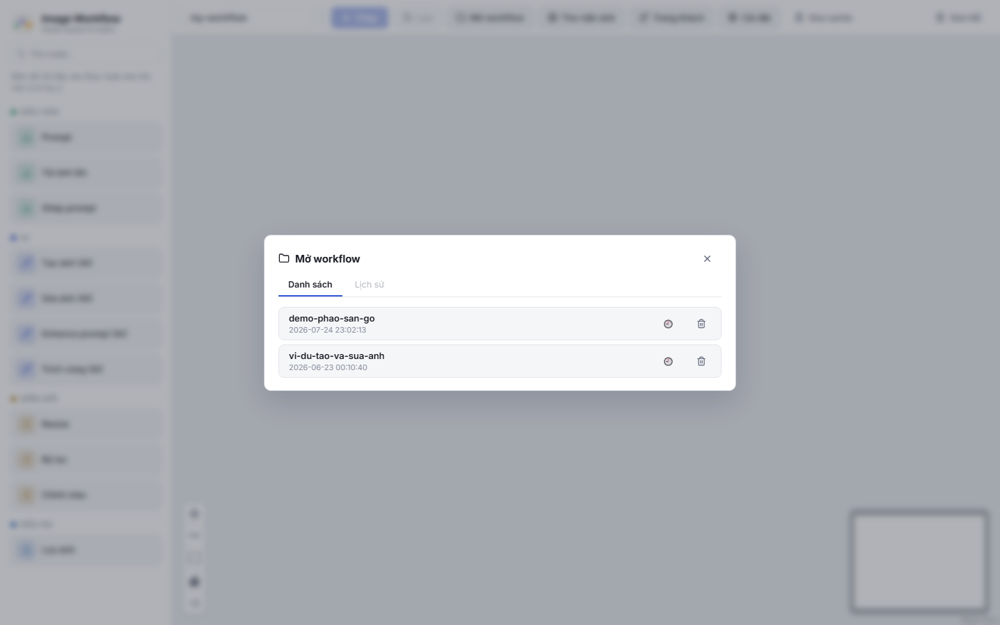
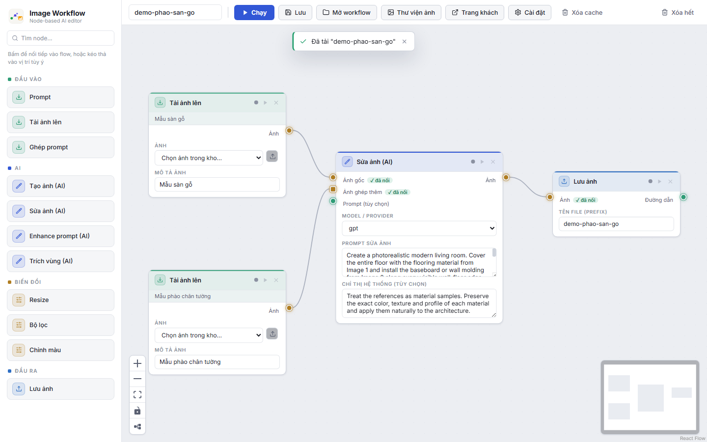
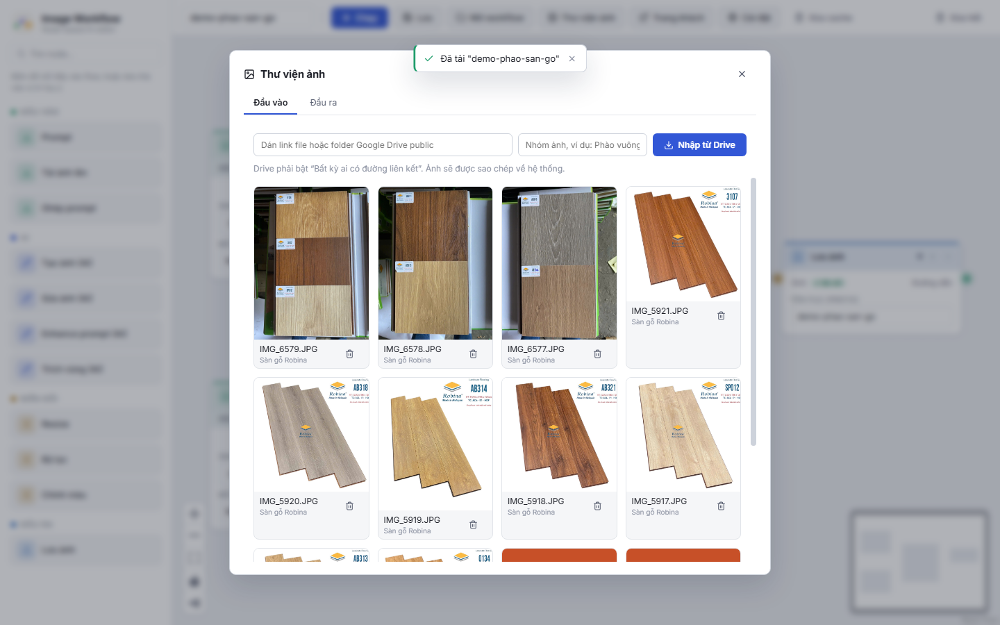
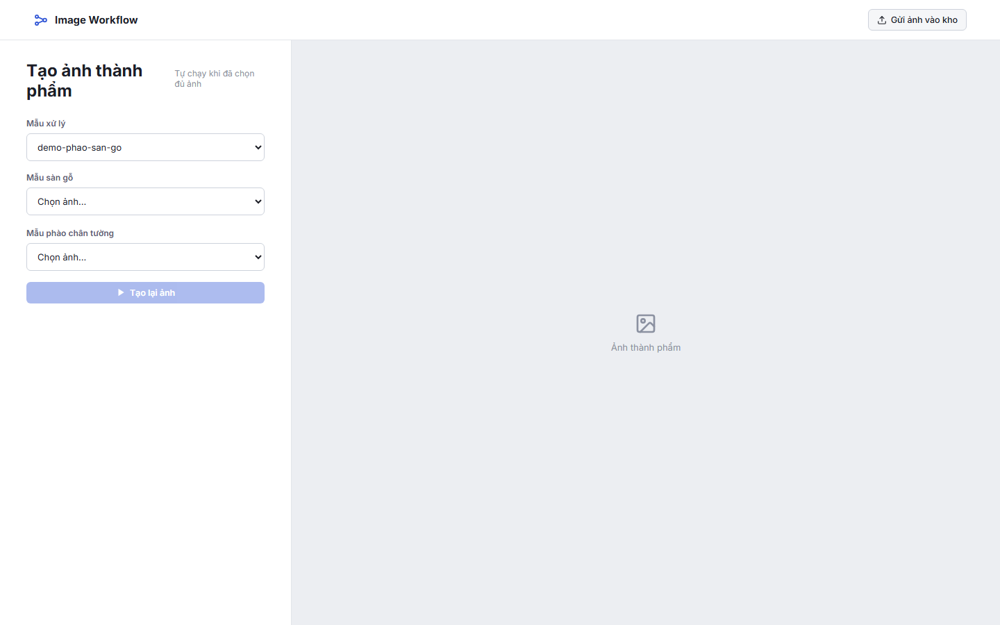
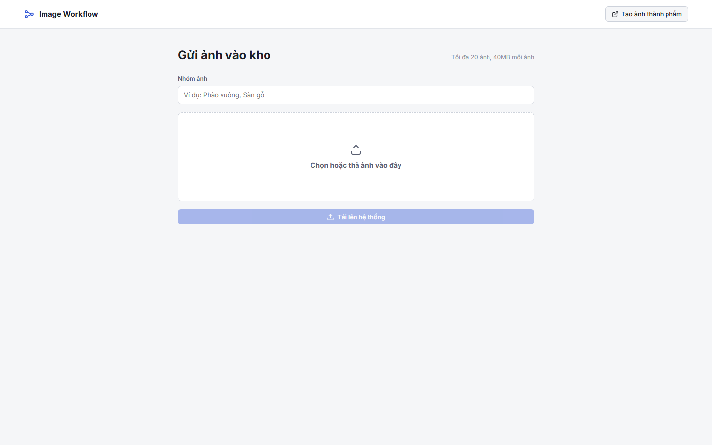

# Hướng dẫn demo phào và sàn gỗ

## Chuẩn bị workflow

Tại màn hình chính, bấm **Mở workflow** và chọn `demo-phao-san-go`.

Workflow đã nối sẵn hai ảnh vật liệu vào node AI và node lưu ảnh.

## Nhập ảnh từ Google Drive

Bấm **Thư viện ảnh**, dán link Drive public, nhập nhóm ảnh rồi bấm
**Nhập từ Drive**.

## Trang tạo ảnh cho khách

Bấm **Trang khách** hoặc mở:

`PUBLIC_URL/create?workflow=demo-phao-san-go`

Khách chọn **Mẫu sàn gỗ** và **Mẫu phào chân tường**. Khi chọn đủ hai ảnh,
hệ thống tự chạy và hiện ảnh thành phẩm ở bên phải.

## Trang khách gửi ảnh

Link upload riêng:

`PUBLIC_URL/upload`

Khách nhập nhóm ảnh, chọn hoặc kéo thả ảnh rồi bấm **Tải lên hệ thống**.

`127.0.0.1` chỉ dùng trên máy chạy ứng dụng. Thay `PUBLIC_URL` bằng domain
hoặc link tunnel trước khi gửi khách.
